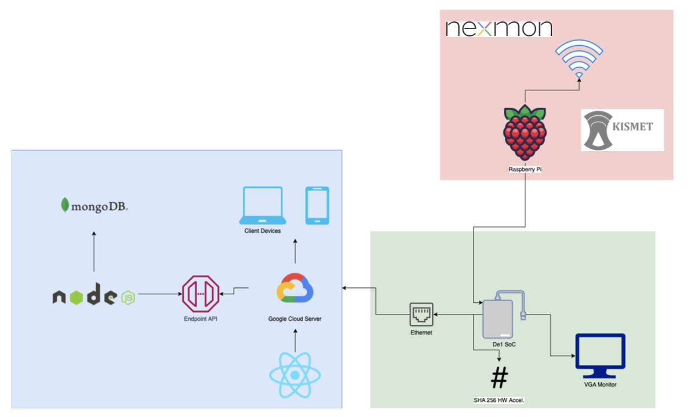

## Busyness
### CPEN 391 Group L2C-36

This project was created by Harrison Mitgang, Ross Mojgani, and Zach Choo.

Busyness is a service which uses a network of edge devices to help students predict busyness levels at different locations.

The project has several components which work together (see below). Each part needs to be set up independently.

#### Setting up the DE1-SoC
To setup the DE1-SoC to run the busyness software stack. Follow the instructions and setup in this [README for the de1-software here](de1-software/readme.md). There is are also more details on the DE1's hardware in the [de1-soc-fpga-vga](de1-soc-fpga-vga/README.md) directory.

#### Setting up the Raspberry Pi
To setup the Raspberry Pi component, which acts as the WiFi card, follow the instructions and setup in this [README for the raspberry pi component here](rpi/readme.md).

#### Setting up the frontend
To setup the frontend component, follow the instructions and setup in this [README for the frontend here](client/README.md).

#### Setting up the backend
To setup the backend component, follow the instructions and setup in this [README for the backend here](server/README.md).
